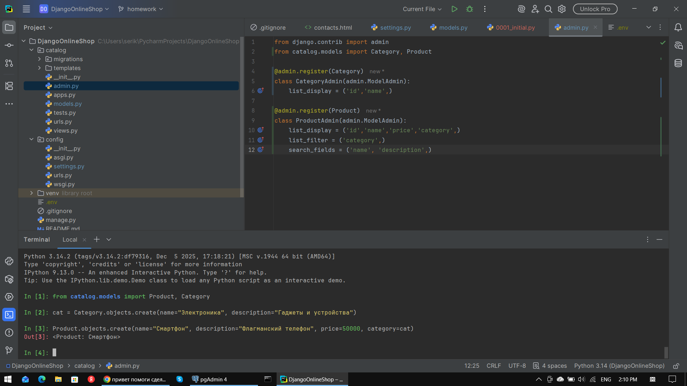
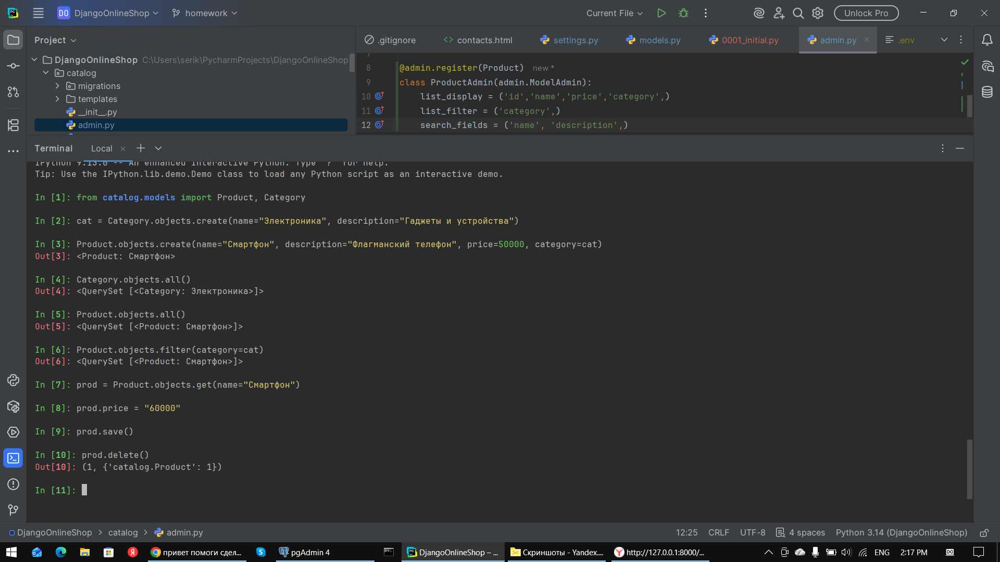

# Django Online Store

Проект представляет собой веб-приложение для интернет-магазина, разработанное на фреймворке Django в рамках учебного курса.

## Функциональность проекта
- **Каталог товаров**: Созданы полноценные связанные модели товаров (`Product`) и категорий (`Category`).
- **Панель администратора**: Настроено продвинутое отображение списков, добавлены фильтры по категориям и поиск по названию/описанию.
- **Главная страница**: Отображает приветственное окно каталога товаров и список из 5 последних добавленных продуктов (выводятся в консоль сервера).
- **Страница контактов**: Контактная информация динамически подгружается из базы данных (управляется через админку).
- **Обратная связь**: Форма отправки сообщений (обработка POST-запросов) с защитой от CSRF-атак и выводом уведомления об успешной отправке.

## Стек технологий
- Python 3.14+
- Django 6.0.5+
- PostgreSQL (драйвер `psycopg2-binary`)
- Pillow (для работы с медиаданными)
- Python-dotenv (сокрытие чувствительных данных)
- IPython (интерактивная оболочка shell)
- Bootstrap 5

## Локальный запуск проекта

### 1. Клонирование репозитория
```bash
git clone <ссылка_на_ваш_репозиторий>
cd DjangoOnlineStoreProject
```

### 2. Настройка виртуального окружения
Создайте и активируйте виртуальное окружение:
```bash
python -m venv venv

# Для Windows:
venv\Scripts\activate

# Для macOS/Linux:
source venv/bin/activate
```

### 3. Настройка переменных окружения
Создайте файл `.env` в корневом каталоге проекта на основе шаблона и заполните своими данными для подключения к PostgreSQL:
```text
DB_NAME=django_shop
DB_USER=postgres
DB_PASSWORD=ваш_пароль
DB_HOST=localhost
DB_PORT=5432
```

### 4. Установка зависимостей
```bash
pip install -r requirements.txt
```

### 5. Применение миграций
```bash
python manage.py migrate
```

### 6. Заполнение базы данных тестовыми данными
Для автоматической очистки базы данных и загрузки демонстрационных категорий и товаров из фикстур выполните команду:
```bash
python manage.py fill_db
```

### 7. Запуск сервера разработки
```bash
python manage.py runserver
```
После запуска проект будет доступен в браузере по адресу: http://127.0.0

---

## Отчёт о выполнении работы в Django Shell

Ниже представлены скриншоты, подтверждающие успешное выполнение обязательных ORM-запросов в интерактивной консоли и работу кастомной команды:

1. 
   

2. 
   

---

## Правила ведения разработки (GitFlow)
Разработка проекта ведётся по методологии GitFlow:
- main — стабильная ветка с релизной версией проекта.
- develop — основная ветка разработки, куда сливаются готовые домашние задания.
- feature/ — отдельные ветки под конкретные задачи и домашние задания (например, feature/catalog).